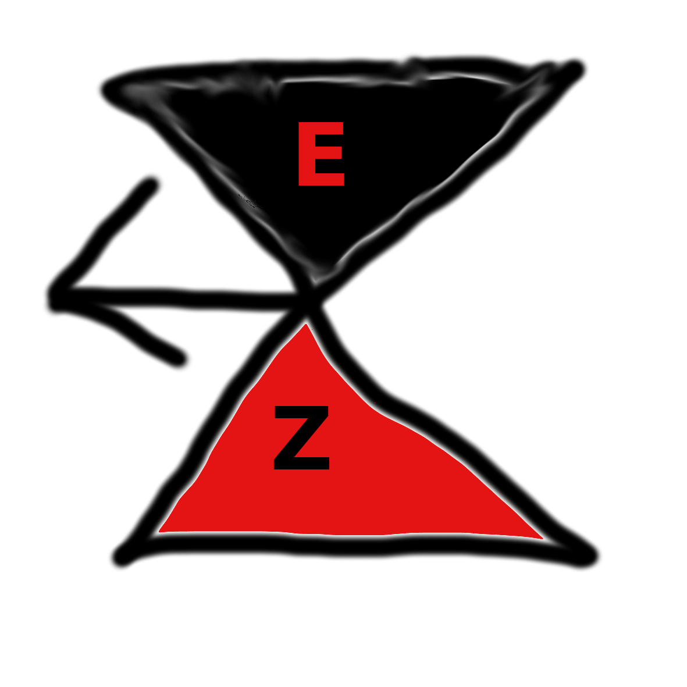

<h1 style="text-align: center;"> EZback</h1>

</img>

<h2 style="text-align: center;"> backup software made EZ</h2>

## install guide

sorry we are still in development 

## dev guide

* clone repo
* install git
* install python
* install requerments

## to do
* make a list of file paths
* make hash file pair list 
